# Database of Fails

A full-stack web platform for sharing 3D printing fails.

## Tech Stack
- **Backend:** Java, Spring Boot, PostgreSQL
- **Frontend:** Angular, TypeScript, HTML, CSS

## Features
- User registration, login and account management
- Browse and search 3D print fail entries
- Add, edit and delete your own fail entries with images
- Like and comment on fails
- Download PDF version of any fail entry
- Admin panel for user management

## UML

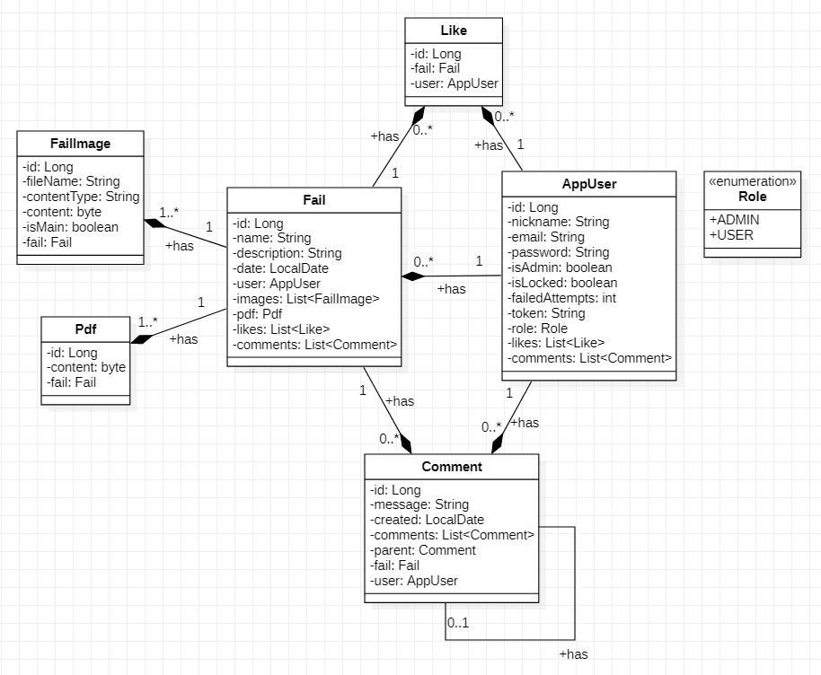

## Interface

### Register Page
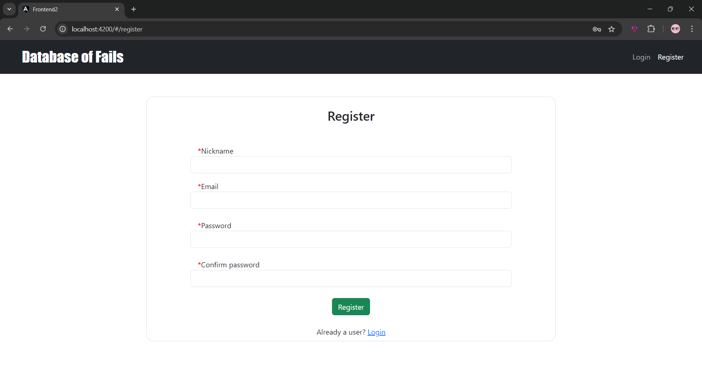

### Login Page
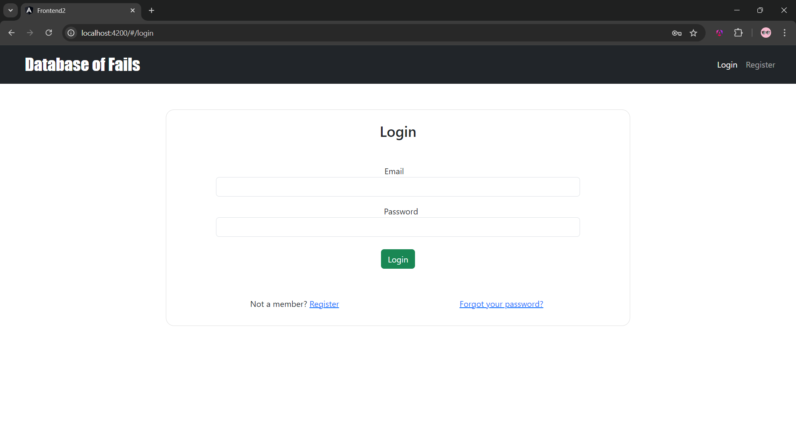

### Account Edit Page
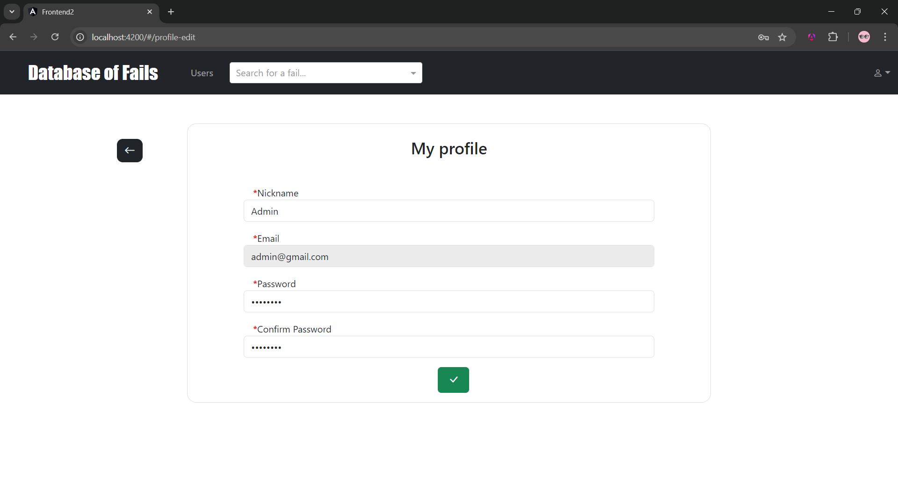

### Database Page
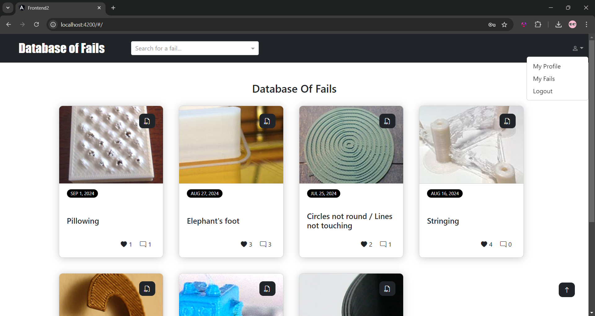

### Fail page (top and bottom)
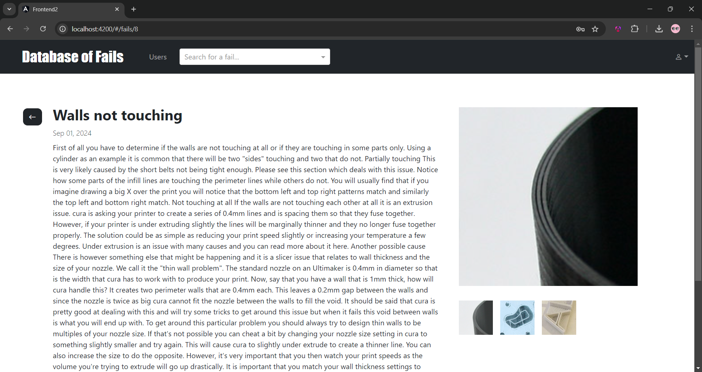

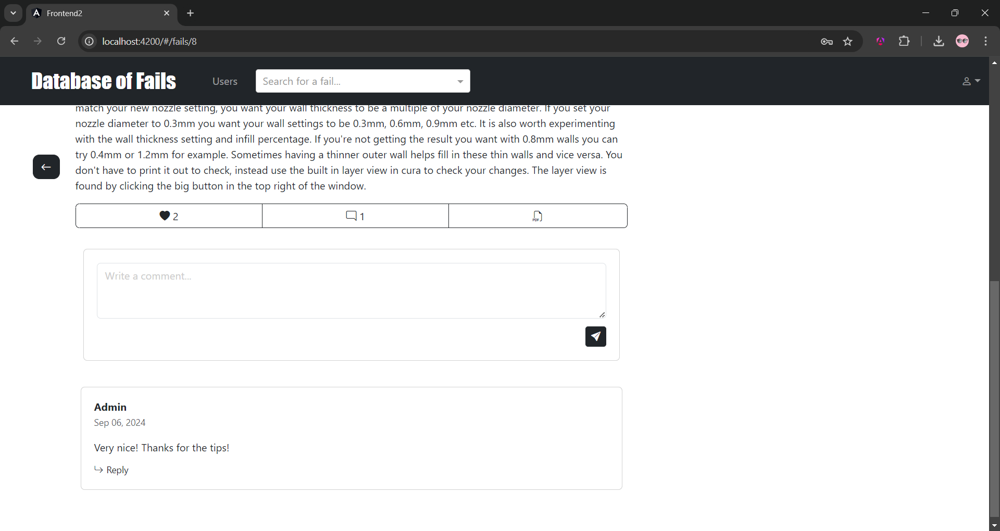

### PDF
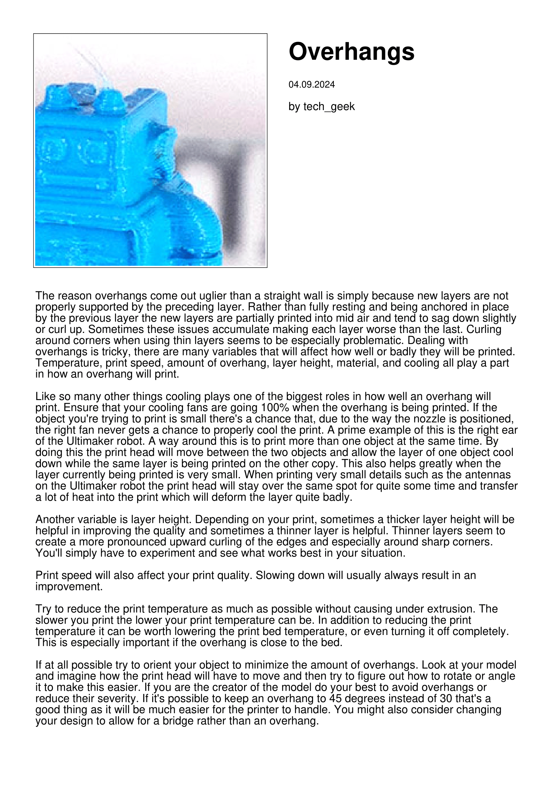

### My Fails Page
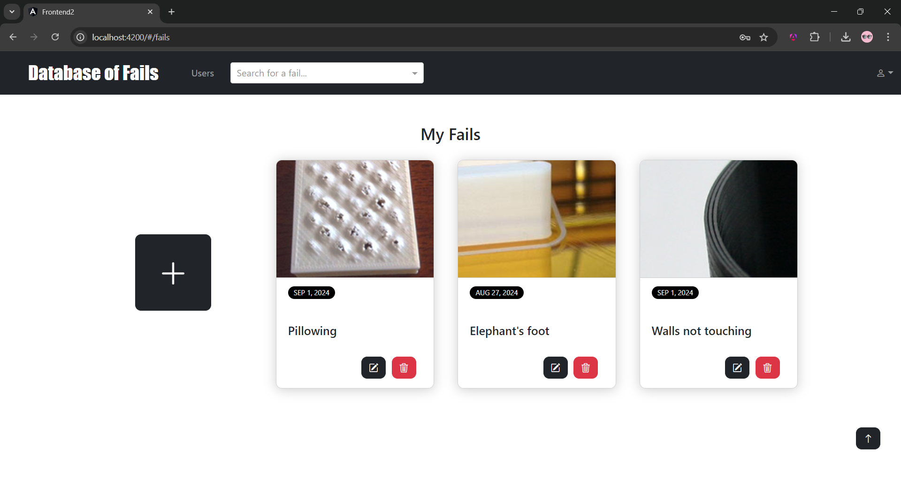

### Add Fail Page
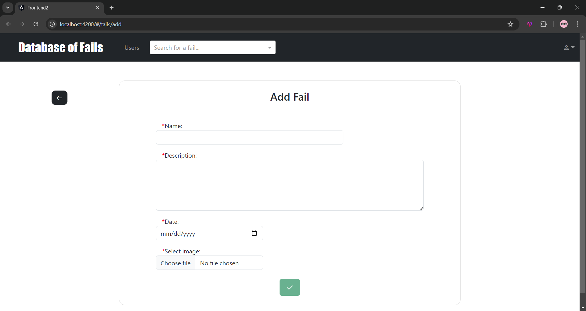

### Users Management Page
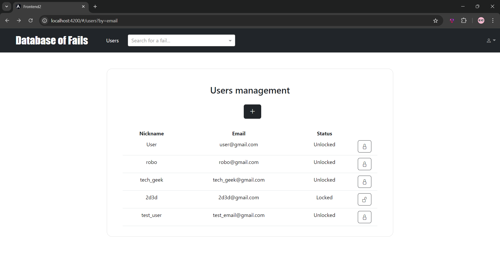

### Add User Page
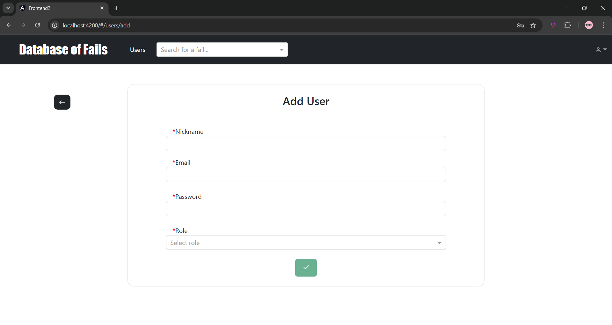
